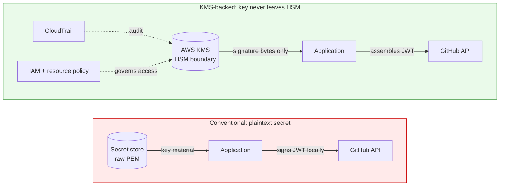
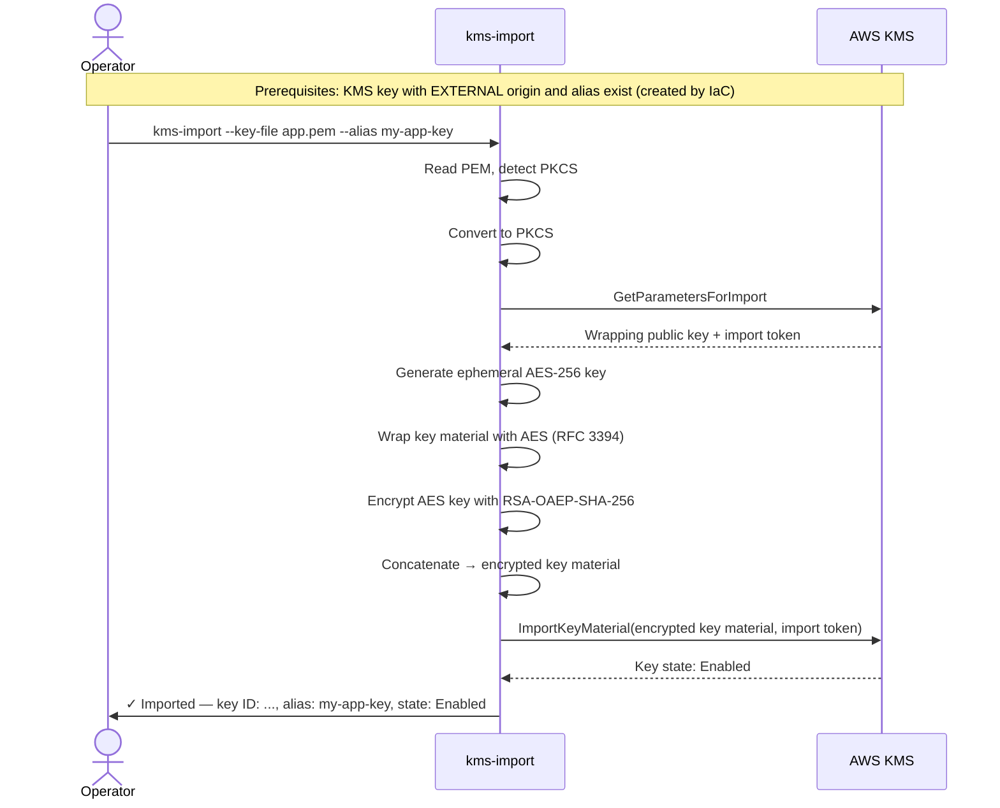

# kms-import

## Problem Statement

GitHub Apps authenticate API calls by signing JWTs with a private key issued by GitHub. The conventional approach — storing that private key as a plaintext secret — creates meaningful exfiltration risk: anyone who can read the secret can impersonate the app indefinitely.

Storing the private key in AWS KMS and delegating JWT signing to the KMS `Sign` API eliminates this risk entirely. Key material in KMS cannot be extracted: it never leaves the HSM boundary in plaintext, no AWS operator can access it, and there is no API to retrieve it. Access is governed by IAM and KMS resource policies, every signing operation is recorded in CloudTrail, and KMS aliases make key rotation a single pointer update with no service downtime. This is a materially stronger security posture than any secrets manager that stores the raw key.



This approach is applicable to any GitHub App running in AWS, not just Chinmina Bridge. However, it remains underused because importing key material into KMS is a high-friction process. An operator must create a KMS key with `EXTERNAL` origin, call `GetParametersForImport` to obtain a wrapping public key and import token, convert the PEM key to PKCS#8 DER, encrypt it with the wrapping key using a specific hybrid algorithm, and finally call `ImportKeyMaterial`. The steps are numerous, the cryptographic details are unforgiving, and there is no existing tool that automates the sequence.

The same process must be repeated for reimport whenever key material is recovered after expiry or manual deletion.

## Solution

A new Go binary and library — `kms-import` — in a dedicated repo under the `chinmina` GitHub organisation. The tool accepts a GitHub App private key PEM file and a KMS key identifier, and performs the full import sequence automatically: fetching wrapping parameters, converting and encrypting the key material, and calling `ImportKeyMaterial`.

Although `kms-import` is a first-class part of the Chinmina Bridge installation process, it is designed for general use by any operator importing a GitHub App private key into AWS KMS.

The core logic is exposed as a Go library with a minimal `KMSClient` interface and a functional options API, so it can be embedded in other tools (including `chinmina-bridge` itself). The CLI is also exposed as a package, allowing `chinmina-bridge` to mount the import command as a subcommand.

Releases are published to GitHub Releases via GoReleaser, with binaries signed by Cosign for supply chain integrity. Documentation covers CLI usage, the security rationale for KMS-backed signing, and the minimum IAM permissions required to operate the tool.



## Requirements

### Key material input

1. The tool shall accept a path to a PEM-encoded private key file via a `--key-file` flag.
1. When the PEM block header is `BEGIN RSA PRIVATE KEY`, the tool shall treat the key as PKCS#1 format and convert it to PKCS#8 DER before import.
1. When the PEM block header is `BEGIN PRIVATE KEY`, the tool shall treat the key as PKCS#8 format and convert it to DER before import.
1. If the PEM block header is neither `BEGIN RSA PRIVATE KEY` nor `BEGIN PRIVATE KEY`, then the tool shall exit with an error describing the unsupported format.
1. If the file at `--key-file` cannot be read, then the tool shall exit with an error identifying the file and the reason.
1. If the PEM content cannot be decoded, then the tool shall exit with an error.

### KMS key identification

1. The tool shall accept exactly one of `--key-id`, `--key-arn`, or `--alias` as mutually exclusive flags identifying the target KMS key.
1. If more than one of `--key-id`, `--key-arn`, or `--alias` is provided, then the tool shall exit with an error.
1. If none of `--key-id`, `--key-arn`, or `--alias` is provided, then the tool shall exit with an error.
1. When `--alias` is provided without the `alias/` prefix, the tool shall prepend `alias/` before passing the identifier to the AWS SDK.
1. When `--alias` is provided with the `alias/` prefix already present, the tool shall use the value as-is.

### Import operation

1. The tool shall call `GetParametersForImport` using wrapping algorithm `RSA_AES_KEY_WRAP_SHA_256` and wrapping key spec `RSA_4096`.
1. The tool shall encrypt the PKCS#8 DER key material using the wrapping public key returned by `GetParametersForImport`, consistent with the `RSA_AES_KEY_WRAP_SHA_256` algorithm.
1. The tool shall call `ImportKeyMaterial` with the encrypted key material and the import token returned by `GetParametersForImport`.
1. The tool shall use the import token and wrapping public key from the same `GetParametersForImport` response.
1. By default, the tool shall set `ExpirationModel` to `KEY_MATERIAL_DOES_NOT_EXPIRE` and omit `ValidTo`.
1. Where `--expires` is provided, the tool shall set `ExpirationModel` to `KEY_MATERIAL_EXPIRES` and set `ValidTo` to the supplied value.
1. If `--expires` is provided with an invalid or already-passed date, then the tool shall exit with an error before making any AWS API calls.
1. The tool shall support both initial import and reimport using the same invocation — no flag or mode switch is required to distinguish them.

### AWS credentials and configuration

1. The tool shall resolve AWS credentials using the standard AWS SDK credential chain.
1. Where `--profile` is provided, the tool shall use the named AWS profile.
1. Where `--region` is provided, the tool shall use the specified AWS region.
1. Where `--profile` or `--region` is not provided, the tool shall defer to the AWS SDK defaults (environment variables, config file, instance metadata).

### Output

1. Upon successful import, the tool shall print a human-readable confirmation including the resolved KMS key ID and the resulting key state.
1. Where the target was specified via `--alias`, the tool shall include the alias in the confirmation output.
1. Where `--json` is provided, the tool shall output a JSON object containing the key ID, alias (if used), and key state, and shall suppress all other output.
1. If any AWS API call fails, then the tool shall exit with a non-zero exit code and print the error to stderr.

### Library interface

1. The tool shall expose a Go package providing an `Import` function callable without instantiating a CLI.
1. The library shall accept import parameters via functional options.
1. The library shall accept a `KMSClient` interface value as a parameter, exposing only the methods required by the import flow (`GetParametersForImport` and `ImportKeyMaterial`).
1. The library shall not construct or configure an AWS SDK client.
1. The library shall return a structured result value and a Go error; it shall not call `os.Exit`.

### CLI as package

1. The tool shall expose an exported `Command()` function returning a urfave/cli v3 `*cli.Command`, allowing the command to be mounted as a subcommand of another urfave/cli application.
1. The standalone binary in `cmd/` shall be a thin wrapper that constructs a urfave/cli `App` containing the exported command.

### Release and distribution

1. The repository shall use GoReleaser to build and publish release artifacts to GitHub Releases.
1. GoReleaser shall produce binaries for at minimum: `linux/amd64`, `linux/arm64`, `darwin/amd64`, `darwin/arm64`, and `windows/amd64`.
1. Each release shall include a checksum file covering all release artifacts.
1. Each release binary shall be signed with Cosign using keyless signing (Sigstore OIDC), producing a signature and certificate for each artifact.
1. The repository shall include verification instructions in the README documenting how to verify a downloaded binary using Cosign.

### Documentation

1. The repository shall include CLI reference documentation covering all flags, their types, defaults, and mutual exclusivity constraints.
1. The repository shall document the security rationale for using KMS-backed JWT signing over plaintext key storage, covering: key material non-extractability, IAM and resource policy access control, CloudTrail audit visibility, and alias-based rotation.
1. The repository shall document the minimum AWS IAM permissions required to run the tool, expressed as an IAM policy document.
1. The IAM documentation shall separately identify permissions required on the KMS key resource policy and permissions required in the caller’s IAM policy.
1. The repository shall document the recommended alias-based rotation workflow for updating to a new GitHub App private key.

## Implementation Decisions

**Wrapping algorithm:** `RSA_AES_KEY_WRAP_SHA_256` with `RSA_4096` is hard-coded and not configurable. This is the current AWS recommendation for importing asymmetric private key material. It avoids size-constraint issues that affect the pure `RSAES_OAEP_*` algorithms when used with RSA 2048 key material. This choice is documented in the README.

**`RSA_AES_KEY_WRAP_SHA_256` mechanics:** This algorithm requires generating an ephemeral AES-256 key, encrypting the key material with AES key wrap (RFC 3394), then encrypting the AES key with the RSA-OAEP-SHA-256 wrapping public key, and concatenating the encrypted AES key and the wrapped key material for submission. This is handled entirely within the library.

**PEM format detection:** Detected from the PEM block `Type` field after `pem.Decode`, in the library (`KeyMaterialFromPEM`) — decoding the key file is part of pushing a key, so it lives alongside the wrapping crypto rather than in the CLI. No external flag required. PKCS#1 is the primary path (GitHub’s output format); PKCS#8 is supported as a convenience. Both are converted to PKCS#8 DER before encryption.

**`KMSClient` interface:** Defined in the library package with exactly the two methods used:

```go
type KMSClient interface {
    GetParametersForImport(ctx context.Context, input *kms.GetParametersForImportInput, opts ...func(*kms.Options)) (*kms.GetParametersForImportOutput, error)
    ImportKeyMaterial(ctx context.Context, input *kms.ImportKeyMaterialInput, opts ...func(*kms.Options)) (*kms.ImportKeyMaterialOutput, error)
}
```

The AWS SDK `*kms.Client` satisfies this interface directly.

**Alias normalisation:** Applied in the CLI layer before passing to the library. The library accepts any valid KMS key identifier string; normalisation is not its responsibility.

**Expiry flag format:** RFC 3339 / ISO 8601 timestamp, consistent with AWS CLI conventions (e.g. `2027-01-01T00:00:00Z`).

**Reimport:** No special handling required. `ImportKeyMaterial` accepts the call whether the key state is `PendingImport` or `Enabled` (with deleted material). The AWS API enforces the constraint that reimport must use the same key material as the original import for asymmetric keys.

**Module path:** `github.com/chinmina/kms-import`

**Binary name:** `kms-import`

**Urfave CLI version:** v3.

**GoReleaser:** Standard GoReleaser v2 configuration. Cosign keyless signing is performed in the GoReleaser GitHub Actions workflow using the `sigstore/cosign-installer` action and `cosign sign-blob` against each artifact after build. The checksum file is also signed.

**Minimum IAM permissions:** The caller needs two things: an IAM policy allowing `kms:GetParametersForImport` and `kms:ImportKeyMaterial` scoped via a `kms:RequestAlias` condition where an alias is the intended target; and a KMS key resource policy statement granting the same two actions to the caller’s principal. These are documented as separate policy fragments in the README, matching the pattern already established in the chinmina-bridge KMS documentation.

## Testing Decisions

Unit tests are required for:

- **PEM parsing and format detection:** PKCS#1 input, PKCS#8 input, unsupported header, malformed PEM. These are pure functions with no AWS dependency.
- **Alias normalisation:** bare name, already-prefixed name, empty string.
- **Core import logic:** using a mock `KMSClient`. Test cases cover successful import, `GetParametersForImport` failure, `ImportKeyMaterial` failure, and mismatched token/public key.
- **Expiry flag validation:** past date, invalid format, valid future date.
- **JSON output:** confirm structure matches documented schema.

No integration tests against real AWS in the repository. Integration testing is an operational concern handled outside the repo.

Each EARS requirement maps to at least one test case. Requirements 4, 5, 6, 8, 9, 18, and 27 specifically require error-path test coverage. Requirements 35–44 (release and documentation) are verified by review, not automated tests.

## Out of Scope

- Creating the KMS key (`CreateKey`). The key and alias are assumed to exist, created by IaC (CDK or Terraform).
- Deleting imported key material (`DeleteImportedKeyMaterial`).
- Updating the KMS key alias to point to a new key (alias-based rotation).
- Fetching the GitHub App private key from the GitHub API or any remote source.
- Stdin as a key input method.
- Any KMS key spec other than RSA 2048 (the spec GitHub App keys use).

## Further Notes

**Why a separate repo?** The importer is an operational tool run by humans during setup and key rotation events, not a runtime dependency of `chinmina-bridge`. A separate repo gives it an independent release cycle and makes it usable by operators who don’t run the bridge themselves.

**Alias-based rotation:** The recommended production pattern (documented in the chinmina docs) is to always reference the KMS key via an alias. To rotate to a new GitHub App private key: create a new KMS key with `EXTERNAL` origin (via IaC), import the new private key using this tool, then update the alias to point to the new key. The chinmina service requires no restart or configuration change.

**Expiry guidance:** The `--expires` flag exists for organisational compliance requirements. For operational key revocation, revoke the GitHub App private key in GitHub — this is faster and more direct than waiting for KMS key material expiry.

**chinmina-bridge integration:** `chinmina-bridge` can add `kms-import` as a Go module dependency and mount `Command()` as a subcommand (e.g. `chinmina-bridge kms import`), giving operators a single binary for both runtime and operational tasks.
